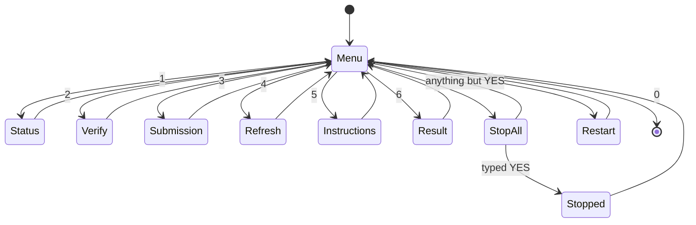

# App Flow — the operator console

There is no web interface and no GUI. There is one interactive surface, and it is
the one that matters: a `cmd.exe` menu, `go.cmd`, that stands between finished
mathematics and a permanent public record. This file describes that flow and the
generated documents it hands the operator.

**Half of what this file describes is not in this repository, on purpose.**
`go.cmd`, `START HERE.md`, `announce.py`, `RESULT - READ ME.txt` and the
`*_STATUS.md` files are session scaffolding for one person at one keyboard, and
`.gitignore` excludes them from the public tree — they were removed on
2026-08-04 and the ignore rules are there so an overnight script cannot quietly
put them back. Do not go looking for them in a clone; nothing here depends on
them. What is published and runnable is `verify_all.py`, `make_submit_pack.py`,
the generated `SUBMIT.md` and `tools/`, and the entry point for a reader is
`python verify_all.py`, described in the README.

This file is kept because the design reasoning is the point of it — where the
console refuses, what it prints when it has nothing to say, and why the
irreversible step asks for a typed word. Read it as a design record of a private
tool, not as a guide to files you can open.

Everything below was read out of `go.cmd`, `START HERE.md`, `verify_all.py` and
`make_submit_pack.py` as they stood, including the parts that were wrong at the
time of writing.

[PRD.md](PRD.md) · [DESIGN_BRIEF.md](DESIGN_BRIEF.md)

## Ways in

| Arrival | What it is |
|---|---|
| Double-click `go.cmd` | the intended entry point, and the only one the operator is asked to remember |
| `START HERE.md` | the written procedure; opened from menu option 5 |
| `RESULT - READ ME.txt` appearing in the folder | written by `announce.py` when something lands. Named to sort first and to be unmissable |
| `<seq> APPROVED - READ ME.txt` in the home directory | written by `tools/oeis_campaign_watch.py` the moment an OEIS submission is approved, naming what to submit next |
| `python verify_all.py` in a terminal | the gate, directly; the same thing menu option 2 runs |

## From finished mathematics to a pasted term

The state this project is actually in: all five terms approved and live in the
OEIS, nothing computing. The path below is the one that was walked five times.

1. **An approval file appears.** The watcher writes it, names the approved
   sequence, and names the next one to submit. It keeps running for the rest.
2. **Open `go.cmd`.** If `RESULT - READ ME.txt` exists, the menu shows a
   `*** SOMETHING HAS LANDED — press 6 to read it ***` banner above the options.
3. **Option 1, Status.** Lists any solver processes with their accumulated CPU
   time, the last few lines of the run log, the cross-check verdict, and whether
   `OVERNIGHT_STATUS.md` contains the word `HALTED`. CPU climbing means computing
   rather than stuck — the one question that cannot be answered from a log alone.
4. **Option 2, Verify.** Runs `verify_all.py` in full and prints, underneath it,
   the sentence the operator must find: *the last line must say EVERY CLAIM … IS
   SUPPORTED BY EVIDENCE. If it says anything else, DO NOT SUBMIT.*
5. **Option 4, Refresh pack.** Regenerates `SUBMIT.md` from the evidence and
   stamps it with today's date — which is the date that belongs on the
   submission, and the reason this step comes before reading it.
6. **Option 3, Submission.** Asks which sequence, then prints that sequence's
   section of `SUBMIT.md` alone: five numbered blocks matching the fields of the
   OEIS edit form, each a literal copy-paste block.
7. **Paste into oeis.org**, one sequence, then stop. `START HERE.md` §4 carries
   the four house-style rules the editors enforce, learned the expensive way on
   the first submission.
8. **Wait.** Editors are volunteers; days to weeks. Nothing else is done until
   that entry is *accepted*, not merely commented on.

## Every state the console can be in

The template's "unauthorised" column has no meaning here — there is no login.
Its honest analogue is **refused**: the state where the console has evidence that
something must not be submitted. That column is the one that earns the design.

| Screen | Empty / first run | Populated | Error | Refused | Slow |
|---|---|---|---|---|---|
| **Menu** | no banner; eight options | banner line when `RESULT - READ ME.txt` exists | an unrecognised key redraws the menu | — | instant |
| **1 Status** | prints nothing under each heading when nothing is running — reads as blank, not as "idle" | one line per process with CPU seconds, last log lines, `AGREES` verdict | missing log file surfaces as a raw PowerShell error | `HALTED` in `OVERNIGHT_STATUS.md` prints under its own heading, and `START HERE.md` says submit nothing until it is looked at | instant |
| **2 Verify** | — | one `[PASS]`/`[FAIL]` line per check, then a count, then a single verdict sentence | failed checks are listed again by name at the end | any `[FAIL]` is itself the refusal; the printed rail says DO NOT SUBMIT | 12 s measured 2026-08-03, both slow audits included; longer wherever the DRAT binaries are installed |
| **3 Submission** | — | the chosen sequence's five paste blocks | **a blocked sequence raises a PowerShell `ArgumentOutOfRangeException` — see Dead ends** | intended: blocked terms should not be offered at all | instant |
| **4 Refresh pack** | — | `wrote …SUBMIT.md` plus `ready:` and `blocked:` lines | generator exits non-zero and says why | a term with no agreeing cross-check or no family gate is excluded automatically and listed under `blocked:` | seconds |
| **6 Result** | `Nothing has landed yet. That file appears by itself when it does.` | the announcement text | — | the announcer never asserts a term is safe; where a cross-check is still needed it says so | instant |
| **7 Stop everything** | — | requires typing `YES`; then kills the solver processes and sweeps stray workers | — | this is the destructive option and it is the only one with a typed confirmation | ~3 s |
| **8 Restart jobs** | — | one line per script: `already running` or `restarted` | — | — | instant |

## Transitions

Every screen returns to the menu through a `pause`. There is no nesting beyond
the one sub-menu in Submission, and no way to reach a screen except from the
menu — deliberate, because the operator arrives at this console rarely and should
never have to remember where they are.

## What the flow refuses to do

- **Offer a term the evidence does not support.** `make_submit_pack.py` excludes
  any term without an agreeing cross-check *for that family* and without evidence
  that the family gate reproduced the previous published value. Excluded terms
  are printed under a `NOT ready — do not submit these` heading with the reason.
- **Let a stale pack look current.** Option 4 exists so the pack is regenerated
  immediately before it is read, and `verify_all.py` fails if `SUBMIT.md` offers
  or omits the wrong thing.
- **Submit anything.** No option in this menu talks to oeis.org. The watcher is
  read-only and holds no credential. Pasting is a human act, on purpose.
- **Lose work when stopped.** Option 7 states, truthfully, that results already
  found are committed and pushed as they land; option 8 states that every script
  skips work whose result exists on disk.

## Dead ends

Two, both real, both found while writing this document. Neither is fixed here —
this is a documentation pass and changing the console is a behaviour change.

1. **Option 3 crashes on a blocked sequence.** The sub-menu still lists
   `1 A217059 a(9)=74 <-- submit this one FIRST`. A217059 was withdrawn: it now
   appears in `SUBMIT.md` only as a bullet under *NOT ready*, so there is no
   `## A217059` heading, `IndexOf` returns `-1`, and the `Substring` call raises
   `ArgumentOutOfRangeException`. The operator sees a red .NET stack trace where
   they expected the thing to paste — and the option that pointed them there
   called it the one to submit first. Reproduced 2026-08-03. The console should
   read ready/blocked from the pack instead of from a hardcoded list.
2. **The "SOMETHING HAS LANDED" banner never clears by itself.** It is present
   whenever `RESULT - READ ME.txt` exists, and that file's own first line says
   *delete this file once read*. A banner that persists after it has been read
   stops being a signal, and the only way out is a file deletion the menu never
   offers.

One further staleness, not a dead end but the same class: `check.cmd` still
expects to find searches that have finished. `START HERE.md` already tells the
operator to use option 1 instead, which is a documentation patch over a surface
that should have been retired.

## Readable under pressure

`cmd.exe` sets most of the floor and the rest is discipline.

- **Keyboard only, throughout.** Every action is a single digit and Enter; there
  is nothing to click and no pointer target.
- **Colour is never a signal.** The console prints no colour at all. Status is
  carried by words — `PASS`, `FAIL`, `HALTED`, `AGREES`, `already running` — so
  the output survives a screen reader, a pipe to a file, and a paste into a
  message.
- **Plain ASCII.** No box-drawing characters, no emoji, no glyph that depends on
  the code page a given machine happens to be in. The banners are rows of `=`.
- **Nothing time-limited.** Every screen ends in `pause`; no state expires while
  it is being read, and no decision is on a timer.
- **The destructive path is the only one that asks.** Typing `YES` is a
  deliberate friction, and it is not asked anywhere else, so it stays meaningful.
